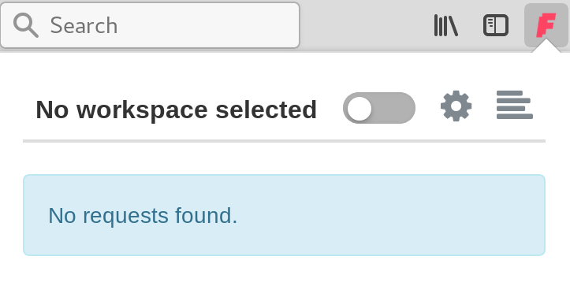
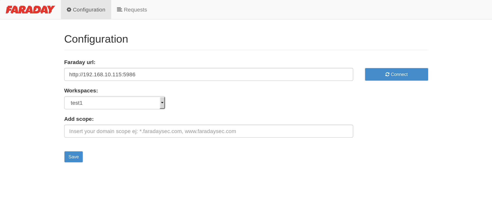
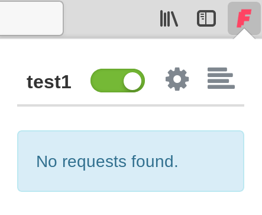

## About

**Faraddon** es un simple addon para reportar vulnerabilidades desde el propio browser a tu servidor de faraday. Faraddon se
encarga de capturar los requests que viajan a travez del navegador y provee la opcion de accederlos como si se tratasen de una vulnerabilidad.
De esta manera el pentester no tiene que preocuparse del tedioso proceso de ingresar los datos referentes a una vuln a mano, si no que
puede ir directo al requests vulnerable, crear el issue desde el propio addon y enviarlo a faraday directamente.	

## Compatibility


## Getting Started!

Para comenzar a usar faraddon una vez instalado, lo primero es iniciar session en faraday


Una vez estemos logueados, nos vamos al icono del addon y clickeamos en la ranura de configuracion sobre la esquina superior derecha.



Solo agregar la url del servidor y dar click en Connect



La url debe tener el siguiente formato: protocol://ip:port

Si todo esta saliendo bien, deberias ver la lista de tus workspaces.

Una vez seleccionado el workspace damos click en save.

Si queremos establecer un scope, para que faraddon solo capture los request de un dominio especifico:

dominio.com

El scope soporta expresiones regulares, por ejemplo, si quisieramos recolectar los requests de todos los subdominios de faradaysec.com

*.faradaysec.com


Una vez configurado faraddon, activamos el addon para comenzar a capturar los requests.



# Adding a vulnerability to Faraday

A partir de ahora todos los requests que se realizen en el navegador seran capturados por el addon, en el siguiente ejemplo se encontro
un xss en una aplicacion vulnerable, para crear el issue y enviarlo a faraday nos vamos al icono que se encuentra a la derecha del requests vulnerable y le damos click.


Esto nos lleva a un formulario donde tendremos que rellenar los datos necesarios para enviar la informacion. Tenemos la posibilidad de usar
los templates de vulnerabilidades que se encuentren cargados en el servidor de faraday, con solo escribir el nombre de una vulnerabilidad
dentro del campo vulnerabilities templates.


Una vez Completado el issue, lo enviamos a faraday, asi de simple.


Como podemos ver se agrego una nueva vulnerabilidad en el workspace


## Instalation

```
$ git clone https://majinbuu.infobyte.lan/fedef/faraddon.git

```

* En la barra de busqueda de Firefox escriba **about:debugging**.

* Click en el boton **Load Temporary Add-on**

* Seleccione cualquier fichero dentro del directorio donde ha clonado **Faraddon**.
