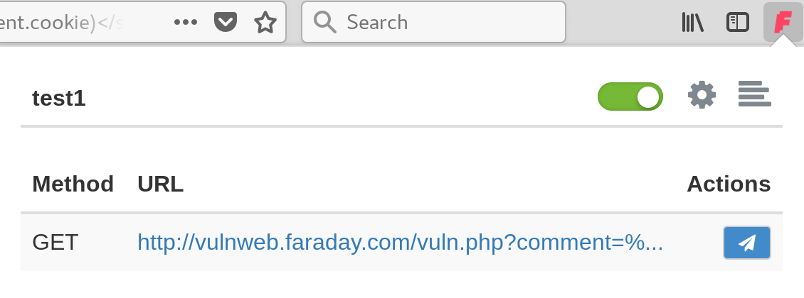
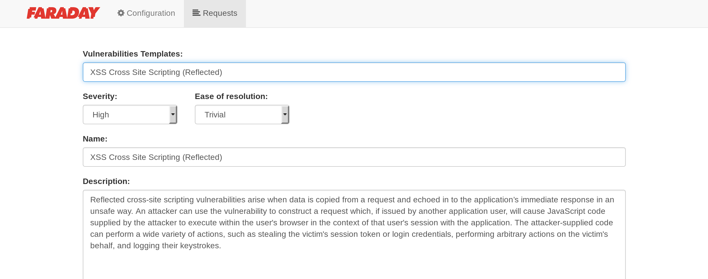
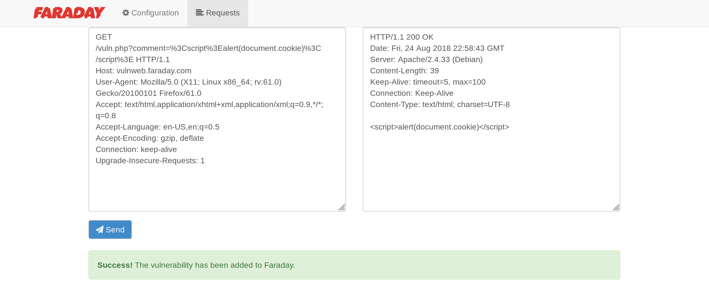

## About

**Faraday Addon** is a simple addon for automate reporting vulnerabilities through the browsed to your own Faraday instance. Faraddon intercepts every single request from the browser, adding a functionality for accessing each one of them treating them as a vulnerability. In this way, a pentester only has to use the addon to send potential vulnerables requests to Faraday, instead of copy-paste them into the server.

## Compatibility

By now, Faraddon is only available for **Firefox Quantum**. We are working for an stable **Chrome** release.


## Installation

### For Users

Download and install the last release from Firefox addons repository:

[Faraday Addon](https://addons.mozilla.org/es/firefox/addon/faraday-addon/)

### For Developers

```
$ git clone [URL REPO GITHUB]

```

* On Firefox searchbox, write **about:debugging**.

* Click this button: **Load Temporary Add-on**

* Select the **manifest.json** file within the directory you cloned **Faraday Addon**.


## Getting Started!

At first, you must authenticate to your Faraday server.


Once logged in, go to settings.


Just add the Faraday server's URL and click on Connect. (The URL must have this format **[protocol]://[ip/domain]:[port]**)


If your settings are right, you should see your workspaces. Click the workspace you want and save your settings.

Faraday Addon also supports setting scopes using regular expressions, just allowing capturing certaing requests. For example, if you only want to capture every **faradaysec.com** subdomains:

*.faradaysec.com

Now you are ready for capturing requests with Faraday Addon.


# Adding a vulnerability to Faraday

If you had set up everything OK, you will see every request going through Faraday Addon. Imagine that you found a **XSS** and you want to send it to Faraday. For creating a new issue, click in the icon next to the vulnerable request:



A form will pop up, where you should complete it with all the information about the issue. If you have **Vulnerability Templates** previously uploaded to Faraday, this process will be faster.



Once completed, send it to Faraday.



You can check Faraday server for your new vulnerability.


